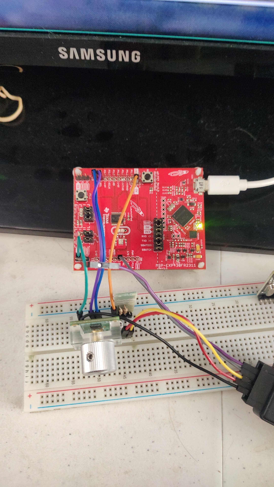

# AS5048B Magnetic Encoder I2C Interface on MSP430FR2311

> **Note:** The documentation in this README and the Doxygen-style comments within the C codebase were drafted and refined with AI assistance.


*Figure 1: Complete hardware assembly including MSP-EXP430FR2311 LaunchPad and logic connections.*


*Figure 2: AMS OSRAM AS5048B Magnetic Position Sensor mounted over a diametric magnet.*

## 🎥 Working Demonstration

Check out the working hardware demo in action:
**[Watch the Demo on TikTok](https://vt.tiktok.com/ZSHYseCus/)**

---

## 1. System Architecture

This repository contains a bare-metal firmware implementation for interfacing the AMS OSRAM AS5048B 14-bit magnetic position sensor with an MSP430FR2311 microcontroller via an I2C bus operating at 100 kHz. 

The system implements a **computational offloading architecture**. To maintain strict real-time determinism on a 16-bit RISC processor lacking a hardware Floating-Point Unit (FPU), the microcontroller performs raw 14-bit register extraction. It bypasses internal interpolation or software-emulated division, packing the high and low bytes into a synchronized UART frame (115200 Baud) for transmission to a host machine. The host executes the floating-point conversion to absolute degrees via the included `readSerial.py` script.

## 2. Driver Library Design (`AS5048B.c` / `AS5048B.h`)

The custom AS5048B driver is engineered specifically for 16-bit hardware constraints:

* **Memory Safety**: Enforces null-pointer verification during initialization to prevent undefined behavior in peripheral memory map addressing.
* **Hardware Alignment**: Reconstructs the 14-bit angular value by applying a `0x3F` bitmask to the low byte, effectively filtering out embedded diagnostic flags (OCF, COF) before execution.
* **Bus Optimization**: Replaces bulk register reads with targeted I2C polling for specific addresses (e.g., `REG_DIAG`), reducing I2C bus lock-time from approximately 1.0 ms to 200 µs per transaction.
* **Zero-Position Calibration**: Implements the sequential two-byte OTP (One-Time Programmable) register clearing and writing procedure defined in Section 7.2.1 of the AS5048B datasheet.

## 3. Engineering Justification for 16-Bit MCU Deployment

While 32-bit ARM Cortex-M architectures dominate new product introductions, deploying this implementation on the legacy MSP430FR2311 provides specific, measurable architectural advantages for deterministic sensor node applications:

1.  **Execution Determinism**: The system operates entirely bare-metal without the overhead of a manufacturer HAL or RTOS scheduler. Interrupt Service Routines (ISRs) utilize the `__even_in_range` intrinsic, forcing the compiler to generate an optimized branch table that ensures O(1) execution time for all hardware state transitions.
2.  **Ferroelectric RAM (FRAM)**: The FR2311 utilizes 3.75 KB of FRAM. Unlike Flash memory, FRAM writes at maximum bus speed without requiring pre-erase cycles and demands nanojoules of energy per write. This enables Compute Through Power Loss (CTPL) capabilities and non-volatile data logging with near-infinite endurance (10^15 cycles).
3.  **Instruction Cycle Efficiency**: The system sampling rate is hardware-locked to exactly 10 milliseconds utilizing a compiler intrinsic delay (`160,000` clock cycles at 16 MHz). By offloading the IEEE-754 floating-point operations to the host, the MCU avoids linking software emulation libraries (e.g., `__fs_div`), saving approximately 800 to 1,500 CPU cycles per sample loop.
4.  **Resource Utilization**: The project utilizes existing, on-hand hardware (MSP-EXP430FR2311 LaunchPad), maximizing capital efficiency for initial prototyping and baseband signal analysis.

## 4. Directory Structure

```text
AS5048B_I2C_encoder
├── Debug/                     # Compiler outputs, object files, and memory maps
├── include/                   # Header files for abstractions and drivers
│   ├── AS5048B.h              # Sensor API definitions
│   ├── eUSCIA_uart.h          # UART port initialization and TX logic
│   ├── eUSCIB_I2C.h           # I2C Master state machine definitions
│   └── utils.h                # System clock configuration (16 MHz)
├── lnk_msp430fr2311.cmd       # Custom linker command file for FRAM memory mapping
├── readSerial.py              # Host-side Python script for UART frame reconstruction
├── src/                       # Source C implementations
│   ├── AS5048B.c
│   ├── eUSCIA_uart.c
│   ├── eUSCIB_I2C.c
│   ├── main.c                 # 10ms execution loop and MCU initialization
│   └── utils.c
└── targetConfigs/             # Code Composer Studio (CCS) debug probe configurations
    ├── MSP430FR2311.ccxml
    └── readme.txt
``````
## 5.- Host-Side Processing (readSerial.py)
The python script operates as the Floating-Point edge processor. It listens to the designated serial port at 115200 baud. It buffers the asynchronous stream, detects the 0xAA synchronization header, validates the 4-byte frame length, reconstructs the 16-bit payload, and outputs the true angular degree value to the terminal or logging pipeline.
